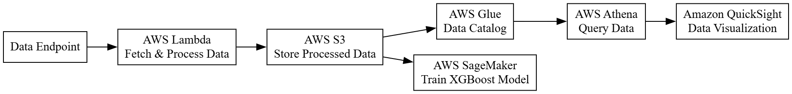

# AWS Data Pipeline - Detailed Documentation

## Introduction
This project demonstrates the use of AWS services to create a data pipeline for processing and analyzing data. It integrates AWS Lambda, S3, Glue, Athena, and SageMaker to provide a comprehensive solution.

## Prerequisites
- AWS Account
- SageMaker Role with necessary permissions
- Python 3.x
- Boto3
- Sagemaker Python SDK

## Project Structure
- `train.py`: Script to train the XGBoost model using SageMaker.
- `deploy.py`: Script to deploy the trained model as an endpoint.
- `predict.py`: Script to make predictions using the deployed model.
- `lambda_function.py`: AWS Lambda function to fetch and process data.
- `README.md`: Overview and setup instructions.
- `DOCUMENTATION.md`: Detailed project documentation.

## Setup Instructions
1. **AWS Configuration**: Ensure your AWS credentials are configured correctly. You can use the AWS CLI to configure credentials:
   ```bash
   aws configure
   ```
2. **Install Dependencies**: Install the required Python packages:
   ```bash
   pip install boto3 sagemaker
   ```

## Data Processing
- Run `lambda_function.py` to fetch data from an endpoint, process it, and store it in S3. AWS Glue is then used to catalog the data for Athena.

## Data Analysis
- Use AWS Athena to query the processed data stored in S3. Visualize the results using Amazon QuickSight.

## Training the Model
- Run `train.py` to initiate the training process on SageMaker. The script sets up the XGBoost estimator and specifies hyperparameters and data channels.

## Deploying the Model
- Run `deploy.py` to deploy the trained model as an endpoint. The script retrieves the latest training job and deploys it.

## Making Predictions
- Run `predict.py` to make predictions using the deployed model. The script sends sample data to the endpoint and retrieves the prediction.

## Data Flow Diagram


## Troubleshooting
- **AWS Permissions**: Ensure your SageMaker role has the necessary permissions for training and deployment.
- **Endpoint Issues**: Verify the endpoint status in the SageMaker console if predictions fail.

## Future Enhancements
- Implement more complex models or hyperparameter tuning.
- Integrate with AWS Lambda for serverless deployment.

## License
This project is licensed under the MIT License.
