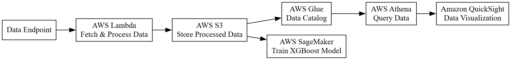

# AWS Data Pipeline

This project demonstrates how to use AWS services to create a data pipeline for processing and analyzing data. The project utilizes AWS Lambda, S3, Glue, Athena, and SageMaker.

## Project Structure
- **train.py**: Script to train the XGBoost model using SageMaker.
- **deploy.py**: Script to deploy the trained model as an endpoint.
- **predict.py**: Script to make predictions using the deployed model.
- **lambda_function.py**: AWS Lambda function to fetch and process data.
- **requirements.txt**: List of required Python packages.

## Getting Started
1. Set up AWS credentials and configure SageMaker.
2. Run `lambda_function.py` to process data and store it in S3.
3. Use AWS Glue to catalog data for Athena.
4. Query data with Athena and visualize with QuickSight.
5. Run `train.py` to train the model using processed data.

## Requirements
- AWS Account
- SageMaker Role with necessary permissions
- Python 3.x
- Boto3
- Sagemaker Python SDK

## Notes
- Ensure your AWS credentials are configured correctly.
- The project uses AWS services for a complete data pipeline solution.

## Data Flow Diagram

## License
This project is licensed under the MIT License.
